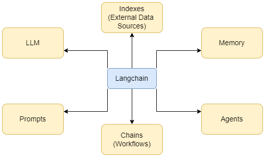

<h1 style="text-align: center;">1. Langchain Chains</h1>

<h2>1.1. Introduction to Langchain</h2>

Langchain is a powerful framework designed to facilitate the development 
of applications using language models. It provides a cohesive platform for 
integrating various components essential to language model-based solutions, 
such as prompts, large language models (LLMs), indexes, memory, chains, and 
agents. By offering streamlined tools and utilities, Langchain enables 
developers to build sophisticated, scalable, and efficient AI-driven 
applications. The framework supports seamless interaction between components,
enhancing the overall functionality and performance of language model 
applications. Whether for generating text, answering questions, or executing 
complex workflows, Langchain provides the necessary infrastructure to harness 
the full potential of language models.

<h3>1.1.1. Prompts</h3>

Langchain Prompts are templates used to structure the input given to 
language models. They help standardize the way questions or commands are 
framed, ensuring consistency and improving the quality of the model’s 
responses.

<h3>1.1.2. LLMs</h3>

Langchain LLMs refer to large language models integrated within the 
Langchain framework. These models are the core engines that process inputs, 
generate text, and perform various language-based tasks.

<h3>1.1.3. Indexes</h3>

Langchain Indexes are structures that organize and manage data, enabling 
efficient retrieval and processing of information. They help in optimizing 
queries and improving the speed and accuracy of responses from language 
models.

<h3>1.1.4. Memory</h3>

Langchain Memory provides a way to store and retrieve information across 
interactions. It allows the system to maintain context and continuity, 
enhancing the user experience by remembering previous inputs and outputs.

<h3>1.1.5. Chains</h3>

Langchain Chains are sequences of actions or processes that link different 
components together. They allow for the creation of complex workflows by 
chaining prompts, model queries, and other operations to achieve specific 
tasks.

<h3>1.1.6. Agents</h3>

Langchain Agents are autonomous entities that use the framework’s components 
to perform specific tasks. They can manage workflows, make decisions, and 
interact with users or other systems, acting as intelligent intermediaries 
in the application.

<h2></h2>

