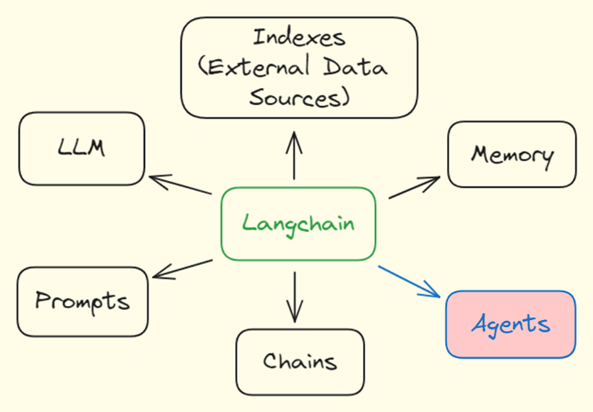
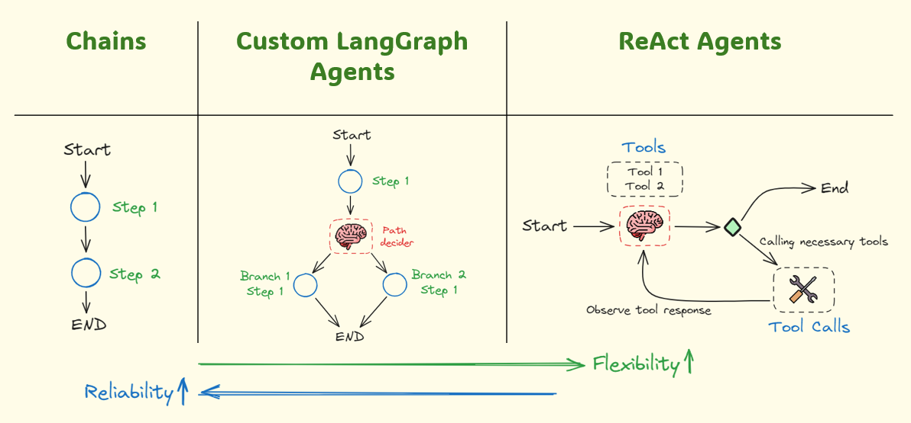

<h1 style="text-align: center;">2. Langchain Agents</h1>

LangChain agents are advanced AI modules designed to leverage large 
language models for various applications, including data extraction, 
summarization, translation, and question-answering. These agents can 
be integrated into workflows to automate complex text processing tasks, 
making them highly efficient for handling and analyzing large volumes of
textual data. With configurable settings and capabilities, LangChain 
agents offer flexibility and precision, enabling users to tailor them to 
specific needs and use cases. By automating repetitive and intricate 
processes, LangChain agents enhance productivity and accuracy, making 
them invaluable tools for businesses and researchers dealing with 
extensive text-based information.

<h2>2.1. Langchain Agent Architectures</h2>

</img> 

<h3>2.1.1. Chains</h3>

The chain architecture of LangChain agents is designed to create seamless 
workflows by linking multiple AI modules in a sequence. Each module, or link 
in the chain, performs a specific task, such as data extraction, 
transformation, or summarization, before passing the output to the next 
module. This architecture allows for complex, multi-step processes to be 
automated efficiently. Users can customize and configure each step to suit 
specific needs, ensuring high flexibility and precision. By structuring AI 
operations into a cohesive chain, LangChain enables comprehensive data 
processing, enhancing the ability to handle extensive and intricate textual 
data effectively.

<h3>2.1.2. Custom LangGraph Agents</h3>

Custom LangGraph Agents in LangChain employ a graph-based architecture to 
create dynamic and flexible workflows. Unlike linear chains, LangGraph 
agents utilize nodes representing distinct AI modules, which can be 
interconnected to form a network. Each node performs specific tasks like 
data extraction, transformation, or analysis, and can route outputs to 
multiple subsequent nodes. This architecture supports complex, branching 
workflows, allowing for greater customization and adaptability. Users can 
design bespoke processes tailored to unique requirements, ensuring precision 
and efficiency. By leveraging a graph structure, Custom LangGraph Agents 
enhance the capability to manage intricate and multifaceted text processing 
tasks effectively.

<h3>2.1.3. ReAct Agents</h3>

ReAct Agents in LangChain utilize a reasoning and acting (ReAct) 
architecture to perform complex tasks. This architecture integrates the 
agent's ability to reason about the context and act accordingly, using a 
combination of language understanding and decision-making capabilities. 
ReAct Agents can dynamically respond to varying inputs by interpreting data, 
making decisions, and executing appropriate actions in a looped process. 
This continuous cycle of reasoning and acting allows for adaptive and 
intelligent behavior in handling intricate tasks. The ReAct architecture 
ensures high flexibility and efficiency, making these agents suitable for 
real-time applications requiring sophisticated text processing and 
context-aware responses.

<h2>2.2. Reference</h2>
<ol>
  <li><a href="https://www.youtube.com/watch?v=XiySC-d346E&t=3s">
        Building and Testing Reliable Agents</a></li>
  <li><a href="https://www.youtube.com/watch?v=NsVnUz7sp_Y&t=10s">
        Building an Agent to Query a SQL Database and Analyze Data</a></li>
</ol>